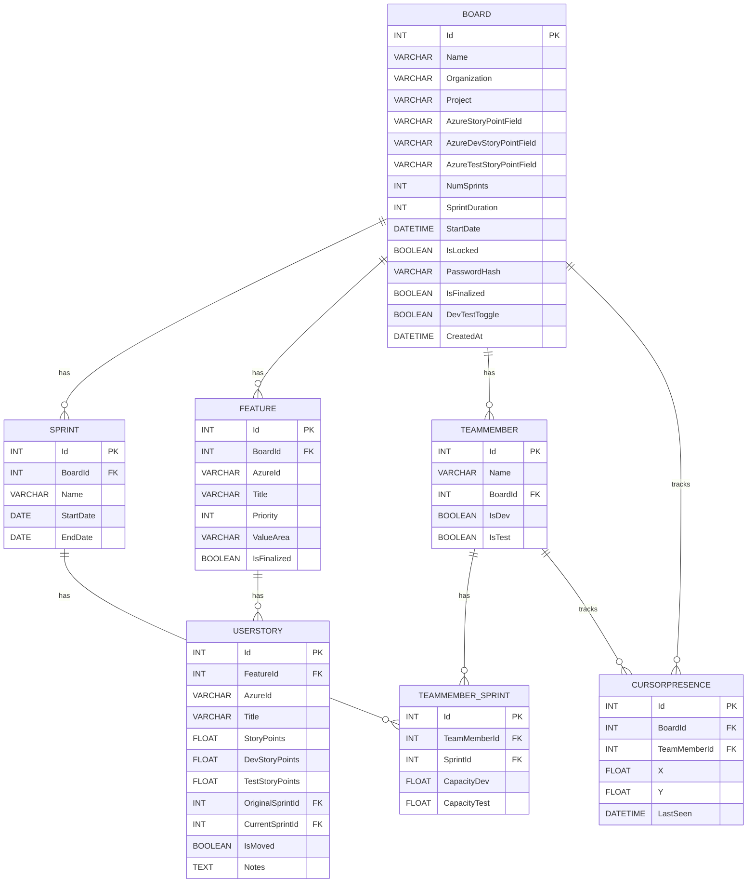

# PI Planning Tool

A web-based **Program Increment (PI) Planning Tool** integrated with **Azure Boards**, enabling teams to plan sprints and features collaboratively in real-time. Inspired by tools like Mural/Miro, but focused on Agile PI planning.

**🎯 Current Status (Feb 20, 2026):** Phase 3A UI refactoring completed. Board component refactored into 6 standalone subcomponents with scoped CSS and dark-mode support. Ready for Phase 3B (responsive UI) or other priorities. See [CHANGELOG.md](CHANGELOG.md) for latest updates.

---

## 🚀 Features

- **Azure Boards Integration**: Fetch Features and User Stories via Azure DevOps REST API.
- **Board Search & Management**:
  - Search and filter boards by name, organization, project, or status.
  - Board preview endpoint for secure access control.
  - PAT validation before accessing boards with Azure features.
- **Interactive Board**: Draggable cards representing User Stories, organized by Feature (rows) and Sprint (columns).
- **Capacity & Load Management**:
  - Team members' capacity per sprint.
  - Dev/Test split for story points and capacities.
  - Load vs capacity visualization.
- **Real-time Collaboration**: Multi-user updates via **SignalR** with cursor presence.
- **Board Configuration**:
  - Unique board ID.
  - Optional password protection.
  - Start date for planning.
  - Finalization mode with visual indicators for moved stories.
- **Security**:
  - PAT validation for Azure DevOps access.
  - Lightweight preview endpoint prevents data leaks.
  - Temporary PAT storage (10-minute TTL).
- **Team Management**:
  - Add/update team members per board.
  - Automatic assignment of Dev/Test capacities per sprint based on `DevTestToggle` and `SprintDuration`.
  - Modify capacity per sprint via API.
- **Notes**: Free-text notes per feature or story for risks or additional info.
- **Dev/Test Toggle**: Switch between total story points and split points.
- **Persistence**: Store board configuration, assignments, and state in SQL Server/PostgreSQL.

---

## 📦 Project Structure

```

pi-planning-tool/
├── backend/pi-planning-backend               # .NET 8 Web API
│   ├── Controllers/
│   ├── Models/
│   ├── Services/
│   ├── Dockerfile
│   └── Program.cs
├── frontend/pi-planning-ui.                   # Angular 20 app
│   ├── src/
│   │   ├── app/
│   │   │   ├── components/
│   │   │   ├── services/
│   │   │   └── models/
│   │   ├── assets/
│   │   └── index.html
│   ├── Dockerfile
│   └── angular.json
├── db/
│   ├── Dockerfile
│   ├── init.sql
├── docker-compose.yml
├── README.md
└── pi-planning-tool.sln

```

---

## 🛠️ Prerequisites

**MacOS Development Environment**:

- [Node.js v24+](https://nodejs.org/)
- [Angular CLI v20+](https://angular.io/cli)
- [.NET 8 SDK](https://dotnet.microsoft.com/en-us/download/dotnet/8.0)
- [Docker & Colima](https://github.com/abiosoft/colima)
- [Git](https://git-scm.com/)

Optional:

- Postman for API testing
- Google Cloud Run account for cloud deployment

---

## ⚙️ Setup & Run

### 1. Clone Repository

```bash
git clone https://github.com/anirbandeb0510/pi-planning-tool.git
cd pi-planning-tool
```

### 2. Start Database (PostgreSQL)

```bash
docker-compose up -d db
```

#### Optional: Enter container to inspect DB

```bash
docker exec -it pi-postgres psql -U postgres -d PIPlanningDB
```

From here, you can run SQL queries, check tables, etc.

### 3. Run EF Core Migrations

1. Navigate to backend:

```bash
cd backend/pi-planning-backend
```

2. Add migration (if not already done):

```bash
dotnet ef migrations add InitialCreate
```

3. Apply migration:

```bash
dotnet ef database update
```

### 4. Backend

```bash
cd backend/pi-planning-backend
dotnet restore
dotnet run
```

**OR** with Docker:

```bash
docker build -f docker/backend.Dockerfile -t pi-planning-backend .
docker run -p 5000:5000 pi-planning-backend
```

### 5. Frontend

```bash
cd frontend/pi-planning-ui
npm install
ng serve
```

**OR** with Docker:

```bash
docker build -f docker/frontend.Dockerfile -t pi-planning-frontend .
docker run -p 4200:4200 pi-planning-frontend
```

### 6. Docker Compose (Full Stack)

```bash
docker-compose -f docker/docker-compose.yml up
```

This will start DB + backend + frontend together.

### 7. Inspect Running Containers

- List running containers:

```bash
docker ps
```

- Enter backend container:

```bash
docker exec -it <container_name_or_id> /bin/bash
```

- Enter database container:

```bash
docker exec -it pi-postgres /bin/bash
```

- Connect to PostgreSQL inside container:

```bash
psql -U postgres -d PIPlanningDB
```

---

## 🗄️ Database

- **SQL Server / PostgreSQL**
- Supports EF Core migrations.
- Optional: Mount local path for persistence with Docker.
- Tables: `Board`, `Sprint`, `Feature`, `UserStory`, `TeamMember`, `TeamMember_Sprint`, `CursorPresence`.

---

## 🧩 ER Diagram



> **Note:** For a nicely styled diagram, use [Mermaid Live Editor](https://mermaid.live) and export as PNG or SVG for README.

---

## 🔗 Azure Integration

- Configure Azure DevOps Project & PAT at board creation.
- Fetch Features & User Stories.
- Optional: Remember PAT in memory for 10 minutes.
- Field mapping configurable for:
  - Story Points
  - Dev Story Points
  - Test Story Points

---

## 🏗️ Architecture

- **Frontend**: Angular 20 + Angular Material + CDK Drag&Drop
- **Backend**: .NET 8 Web API + SignalR
- **Database**: SQL Server / PostgreSQL (Dockerize)
- **Real-time**: SignalR WebSockets
- **Containerization**: Docker & Docker Compose
- **Hosting**: Google Cloud Run (future: Azure App Service)

---

## 📝 Contribution Guidelines

- **Branch Protection**: No direct pushes to `main`. Use PRs.
- **PR Reviews**: Require at least 1 approval before merge.
- **Coding Standards**:
  - Angular: Use `css` (not `scss`).
  - Backend: Clean architecture with controllers, services, and models.

---

## ⚖️ License

MIT License. See [LICENSE](LICENSE).

---

## 👤 Author

Anirban Deb
