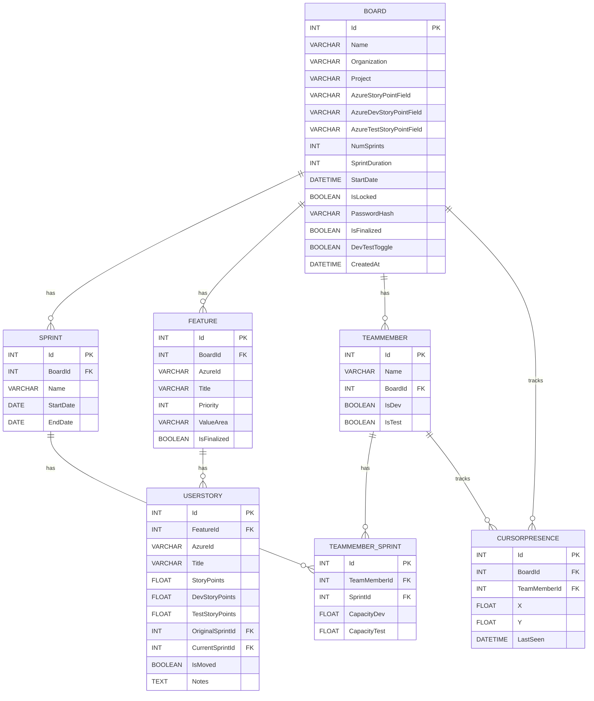

# PI Planning Tool

A web-based **Program Increment (PI) Planning Tool** integrated with **Azure Boards**, enabling teams to plan sprints and features collaboratively in real-time. Inspired by tools like Mural/Miro, but focused on Agile PI planning.

**🎯 Current Status (Mar 13, 2026):** Documentation, provider-isolated migrations, and automated unit testing are complete. The next major milestone is cloud/hosting deployment.

---

## 🚀 Features

- **Azure Boards Integration**: Fetch Features and User Stories via Azure DevOps REST API.
- **Board Search & Management**:
  - Search and filter boards by name, organization, project, or status.
  - Board preview endpoint for secure access control.
  - PAT validation before accessing boards with Azure features.
- **Password-Protected Board Locking**:
  - Lock boards with password to prevent editing (PBKDF2 hashing with salt).
  - Unlock boards with password verification.
  - Real-time lock state updates via SignalR.
  - All mutation operations blocked when board is locked (403 enforcement).
  - Independent from finalization state (can be locked without finalization).
- **Interactive Board**: Draggable cards representing User Stories, organized by Feature (rows) and Sprint (columns).
- **Capacity & Load Management**:
  - Team members' capacity per sprint.
  - Dev/Test split for story points and capacities.
  - Load vs capacity visualization.
  - Unique board ID.
    **Real-time Collaboration**: ✅ Complete SignalR Implementation
    - Live presence tracking: See all connected users working on the board
    - Remote cursor synchronization: View other users' cursor positions in real-time (15Hz throttled)
    - Broadcast events: Story moves, team capacity updates, feature operations sync instantly across all browsers
    - Auto-reconnection: Handles network interruptions gracefully with exponential backoff
    - Idle cursor labels: Auto-hide after inactivity, reappear on movement
    - Concurrent editing: Multiple users can make changes simultaneously without conflicts
  - Start date for planning.
  - Finalization mode with visual indicators for moved stories.
- **Security**:
  - PAT validation for Azure DevOps access.
  - Lightweight preview endpoint prevents data leaks.
  - Temporary PAT storage (10-minute TTL).
- **Team Management**:
  - Add/update team members per board.
  - Automatic assignment of Dev/Test capacities per sprint based on `DevTestToggle` and `SprintDuration`.
  - Modify capacity per sprint via API.
- **Dev/Test Toggle**: Switch between total story points and split points.
- **Persistence**: Store board configuration, assignments, and state in SQL Server/PostgreSQL.

---

## � Documentation

Comprehensive guides for users, developers, and operators:

### For End Users

- **[User Guide](USER_GUIDE.md)**: Complete end-user documentation covering board creation, Azure integration, team management, real-time collaboration, and common workflows

### For Developers

- **[API Reference](API_REFERENCE.md)**: Complete REST API documentation with request/response examples for all 23 endpoints, SignalR WebSocket events, authentication patterns, and troubleshooting
- **[Architecture Guide](ARCHITECTURE.md)**: System architecture, data models, design patterns, validation strategy, and real-time collaboration architecture

### For Operations

- **[Docker Deployment Guide](DOCKER_DEPLOYMENT_GUIDE.md)**: Container deployment with Docker Compose, production configuration, SSL/HTTPS setup, backup/restore, monitoring, and troubleshooting
- **[IIS Deployment Guide](IIS_DEPLOYMENT_GUIDE.md)**: Windows deployment with IIS and SQL Server, complete setup instructions, and production configuration
- **[Configuration Guide](CONFIGURATION.md)**: Environment variables, runtime configuration, CORS setup, database provider selection, and PAT TTL configuration
- **[Security Guide](SECURITY.md)**: Security architecture, PBKDF2 password hashing, input validation, CORS configuration, Azure PAT handling, audit logging, and OWASP Top 10 compliance

## �📦 Project Structure

```

pi-planning-tool/
├── backend/
│   ├── pi-planning-backend/                  # .NET 8 Web API
│   │   ├── Controllers/
│   │   ├── DTOs/
│   │   ├── Data/
│   │   ├── Filters/
│   │   ├── Hubs/
│   │   ├── Middleware/
│   │   ├── Models/
│   │   ├── Repositories/
│   │   ├── Services/
│   │   ├── Dockerfile
│   │   └── Program.cs
│   ├── pi-planning-backend.migrations.postgres/  # PostgreSQL Migrations
│   │   ├── Migrations/
│   │   ├── DesignTimeDbContextFactory.cs
│   │   └── *.csproj
│   ├── pi-planning-backend.migrations.sqlserver/ # SQL Server Migrations
│       ├── Migrations/
│       ├── DesignTimeDbContextFactory.cs
│       └── *.csproj
│   └── pi-planning-backend.tests/           # xUnit backend tests
│       ├── Controllers/
│       ├── Data/
│       ├── Services/
│       └── *.csproj
├── frontend/pi-planning-ui/                   # Angular 20 app
│   ├── src/
│   │   ├── app/
│   │   │   ├── core/
│   │   │   ├── features/
│   │   │   └── shared/
│   │   ├── environments/
│   │   └── index.html
│   ├── Dockerfile
│   ├── angular.json
│   └── package.json
├── db/
│   ├── Dockerfile
│   └── init.sql
├── docker-compose.yml
├── README.md
├── API_REFERENCE.md
├── ARCHITECTURE.md
├── CONFIGURATION.md
├── DOCKER_DEPLOYMENT_GUIDE.md
├── IIS_DEPLOYMENT_GUIDE.md
├── SECURITY.md
├── USER_GUIDE.md
└── pi-planning-tool.sln

```

---

## 🛠️ Prerequisites

**MacOS Development Environment**:

- [Node.js v24+](https://nodejs.org/)
- [Angular CLI v20+](https://angular.io/cli)
- [.NET 8 SDK](https://dotnet.microsoft.com/en-us/download/dotnet/8.0)
- [Docker & Colima](https://github.com/abiosoft/colima)
- [Git](https://git-scm.com/)

Optional:

- Postman for API testing
- Google Cloud Run account for cloud deployment

---

## ⚙️ Setup & Run

### 1. Clone Repository

```bash
git clone https://github.com/anirbandeb0510/pi-planning-tool.git
cd pi-planning-tool
```

### 2. Start Database (PostgreSQL)

```bash
docker-compose up -d db
```

#### Optional: Enter container to inspect DB

```bash
docker exec -it pi-postgres psql -U postgres -d PIPlanningDB
```

From here, run SQL queries, check tables, etc.

### 3. Run EF Core Migrations

#### PostgreSQL (Local Docker Development)

```bash
cd backend/pi-planning-backend.migrations.postgres

# Add migration (if not already done)
dotnet ef migrations add InitialCreate \
  --context AppDbContext \
  --startup-project ../pi-planning-backend/pi-planning-backend.csproj

# Apply migration (backend auto-applies at startup via db.Database.Migrate())
```

#### SQL Server (Windows IIS Deployment)

> For detailed SQL Server/IIS deployment, see [IIS_DEPLOYMENT_GUIDE.md](IIS_DEPLOYMENT_GUIDE.md).

```bash
cd backend/pi-planning-backend.migrations.sqlserver

# Add migration (if not already done)
dotnet ef migrations add InitialCreate \
  --context AppDbContext \
  --startup-project ../pi-planning-backend/pi-planning-backend.csproj

# Apply migration (backend auto-applies at startup via db.Database.Migrate())
```

#### Key Notes

- Each provider (PostgreSQL/SQL Server) has its own isolated migration project
- Migrations are provider-specific and auto-applied at app startup
- No manual `dotnet ef database update` needed in Docker (app does it automatically)
- For IIS deployments, configure SQL Server connection string before building

### 4. Backend (Local Development)

**Important:** Always build the solution first to ensure migration projects are compiled.

```bash
# Step 1: Build entire solution (includes backend + migration projects)
cd /path/to/pi-planning-tool
dotnet build

# Step 2: Run backend
cd backend/pi-planning-backend
dotnet run --launch-profile http
```

**Result:** Backend runs on `http://localhost:5262` with Swagger UI at `http://localhost:5262/swagger`

---

### 5. Frontend (Local Development)

```bash
cd frontend/pi-planning-ui
npm install
ng serve --open
```

**Result:** Frontend serves on `http://localhost:4200` and auto-opens in browser

---

## Testing

### Backend Tests

```bash
cd backend/pi-planning-backend.tests
dotnet test
```

Backend test coverage currently focuses on service logic, controller behavior, and repository integration paths.

### Frontend Tests

```bash
cd frontend/pi-planning-ui
npm test -- --watch=false --browsers ChromeHeadless
```

Notes:

- The frontend `test` script is configured to run Karma against Microsoft Edge on macOS by setting `CHROME_BIN` to the Edge binary path.
- On non-macOS environments, override `CHROME_BIN` as needed for the locally installed Chromium-based browser.
- Current frontend coverage focuses on core services, the name-entry guard and component flow, board calculations, and board API wrapper services.

---

### 6. Docker Compose (Full Stack - Recommended for Integrated Testing)

#### Start All Services (Backend + Frontend + PostgreSQL)

```bash
# From repo root
docker-compose up -d
```

Services will be available at:

- **Frontend:** `http://localhost:4200`
- **Backend API:** `http://localhost:8080`
- **Database:** `localhost:5432` (PostgreSQL)

#### Stop All Services

```bash
docker-compose down
```

#### Stop Only Backend & Frontend (Keep Database Running)

```bash
docker-compose stop backend frontend
```

#### Remove Stopped Containers

```bash
docker-compose rm -f backend frontend
```

---

### 7. Docker Commands Reference

#### View Running Containers

```bash
docker ps
```

#### View All Containers (including stopped)

```bash
docker ps -a
```

#### View Container Logs

```bash
# Follow backend logs in real-time
docker logs -f pi-backend

# View frontend logs
docker logs pi-frontend

# View last 50 lines
docker logs --tail 50 pi-backend
```

#### Stop Individual Containers

```bash
docker stop pi-backend
docker stop pi-frontend
docker stop pi-postgres
```

#### Remove Container

```bash
docker rm pi-backend
docker rm pi-frontend
```

#### Rebuild Docker Image (after code changes)

```bash
# Rebuild backend image
docker-compose build backend

# Rebuild frontend image
docker-compose build frontend

# Rebuild all images
docker-compose build
```

#### Enter Container Shell

```bash
# Backend container
docker exec -it pi-backend /bin/sh

# Frontend container
docker exec -it pi-frontend /bin/sh

# Database container
docker exec -it pi-postgres /bin/bash
```

---

### 8. Inspect Running Containers

- List running containers:

```bash
docker ps
```

- Check container resource usage:

```bash
docker stats
```

- View container details:

```bash
docker inspect pi-backend
```

- Enter backend container:

```bash
docker exec -it <container_name_or_id> /bin/bash
```

- Enter database container:

```bash
docker exec -it pi-postgres /bin/bash
```

- Connect to PostgreSQL inside container:

```bash
psql -U postgres -d PIPlanningDB
```

---

## 🗄️ Database

- **SQL Server / PostgreSQL**
- Supports EF Core migrations.
- Optional: Mount local path for persistence with Docker.
- Tables: `Board`, `Sprint`, `Feature`, `UserStory`, `TeamMember`, `TeamMember_Sprint`, `CursorPresence`.

---

## 🧩 ER Diagram


```mermaid
erDiagram
    BOARD {
        INT Id PK
        VARCHAR Name
        VARCHAR Organization
        VARCHAR Project
        VARCHAR AzureStoryPointField
        VARCHAR AzureDevStoryPointField
        VARCHAR AzureTestStoryPointField
        INT NumSprints
        INT SprintDuration
        DATETIME StartDate
        BOOLEAN IsLocked
        VARCHAR PasswordHash
        BOOLEAN IsFinalized
        BOOLEAN DevTestToggle
        DATETIME CreatedAt
    }

    SPRINT {
        INT Id PK
        INT BoardId FK
        VARCHAR Name
        DATE StartDate
        DATE EndDate
    }

    FEATURE {
        INT Id PK
        INT BoardId FK
        VARCHAR AzureId
        VARCHAR Title
        INT Priority
        VARCHAR ValueArea
        BOOLEAN IsFinalized
    }

    USERSTORY {
        INT Id PK
        INT FeatureId FK
        VARCHAR AzureId
        VARCHAR Title
        FLOAT StoryPoints
        FLOAT DevStoryPoints
        FLOAT TestStoryPoints
        INT OriginalSprintId FK
        INT CurrentSprintId FK
        BOOLEAN IsMoved
        TEXT Notes
    }

    TEAMMEMBER {
        INT Id PK
        VARCHAR Name
        INT BoardId FK
        BOOLEAN IsDev
        BOOLEAN IsTest
    }

    TEAMMEMBER_SPRINT {
        INT Id PK
        INT TeamMemberId FK
        INT SprintId FK
        FLOAT CapacityDev
        FLOAT CapacityTest
    }

    CURSORPRESENCE {
        INT Id PK
        INT BoardId FK
        INT TeamMemberId FK
        FLOAT X
        FLOAT Y
        DATETIME LastSeen
    }

    BOARD ||--o{ SPRINT : has
    BOARD ||--o{ FEATURE : has
    BOARD ||--o{ TEAMMEMBER : has
    FEATURE ||--o{ USERSTORY : has
    SPRINT ||--o{ TEAMMEMBER_SPRINT : has
    TEAMMEMBER ||--o{ TEAMMEMBER_SPRINT : has
    BOARD ||--o{ CURSORPRESENCE : tracks
    TEAMMEMBER ||--o{ CURSORPRESENCE : tracks
```

> **Note:** For a nicely styled diagram, use [Mermaid Live Editor](https://mermaid.live) and export as PNG or SVG for README.

---

## 🔗 Azure Integration

- Configure Azure DevOps Project & PAT at board creation.
- Fetch Features & User Stories.
- Optional: Remember PAT in memory for 10 minutes.
- Field mapping configurable for:
  - Story Points
  - Dev Story Points
  - Test Story Points

---

## 🏗️ Architecture

- **Frontend**: Angular 20 + Angular Material + CDK Drag&Drop
- **Backend**: .NET 8 Web API + SignalR
- **Database**: SQL Server / PostgreSQL (Dockerize)
- **Real-time**: SignalR WebSockets
- **Containerization**: Docker & Docker Compose
- **Hosting**: Google Cloud Run (future: Azure App Service)

---

## 📝 Contribution Guidelines

- **Branch Protection**: No direct pushes to `main`. Use PRs.
- **PR Reviews**: Require at least 1 approval before merge.
- **Coding Standards**:
  - Angular: Use `css` (not `scss`).
  - Backend: Clean architecture with controllers, services, and models.

---

## ⚖️ License

MIT License. See [LICENSE](LICENSE).

---

## 👤 Author

Anirban Deb
